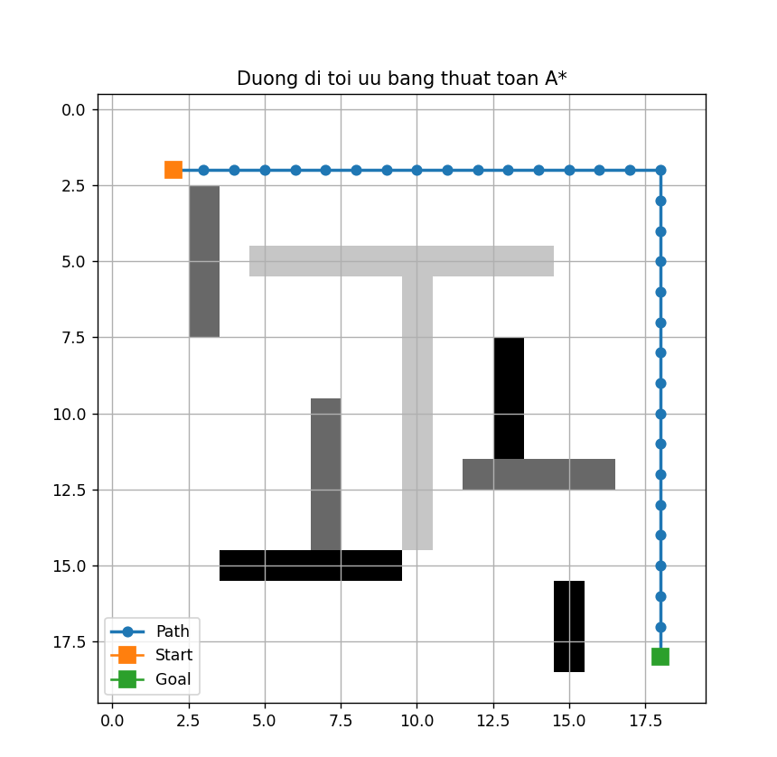
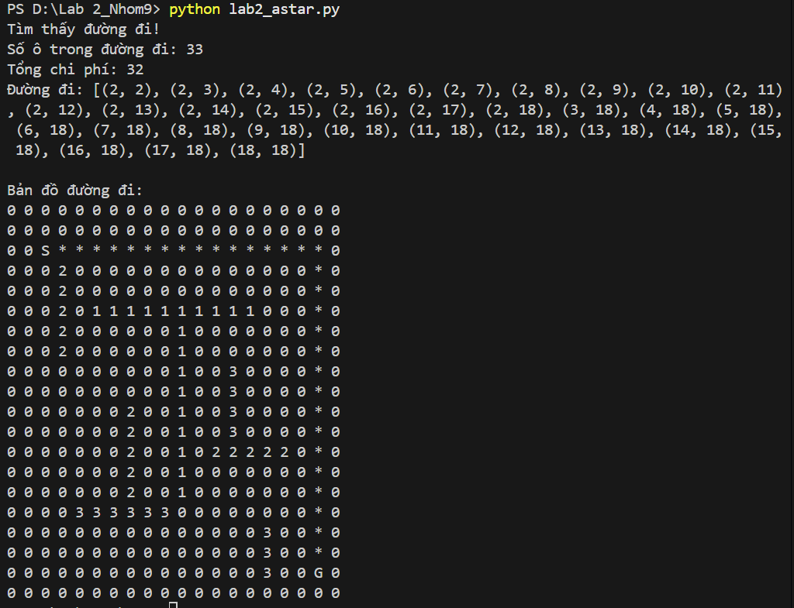

# Lab 2: Thuật toán A*

## 1. Giới thiệu

Bài lab này sử dụng thuật toán A* để tìm đường đi tối ưu cho robot trong kho hàng. Kho hàng được biểu diễn bằng lưới 2D. Robot cần đi từ điểm bắt đầu đến điểm đích với tổng chi phí thấp nhất.

---

## 2. Mô tả bài toán

Mỗi ô trong lưới có ý nghĩa như sau:

| Giá trị | Ý nghĩa | Chi phí |
|---|---|---|
| 0 | Ô trống | 1 |
| 1 | Vật cản | Không đi được |
| 2 | Bùn lầy | 3 |
| 3 | Đá | 5 |

Robot chỉ được đi theo 4 hướng:

- Lên
- Xuống
- Trái
- Phải

Robot không được đi chéo.

---

## 3. Ý tưởng thuật toán A*

Thuật toán A* chọn đường đi dựa trên công thức:

```text
f(n) = g(n) + h(n)

Trong đó:

g(n): chi phí đã đi từ điểm bắt đầu đến ô hiện tại.
h(n): chi phí ước lượng từ ô hiện tại đến đích.
f(n): tổng chi phí dùng để chọn ô đi tiếp.

Vì robot chỉ đi 4 hướng nên chương trình dùng khoảng cách Manhattan:

h(n) = |x1 - x2| + |y1 - y2|
```

---

## 4. Cách hoạt động

Chương trình thực hiện các bước chính:

Đưa điểm bắt đầu vào danh sách chờ xét.
Chọn ô có chi phí f(n) nhỏ nhất.
Kiểm tra các ô lân cận hợp lệ.
Bỏ qua ô vật cản.
Tính chi phí khi đi vào từng loại ô.
Cập nhật đường đi nếu tìm được đường tốt hơn.
Lặp lại cho đến khi đến đích hoặc không còn đường đi.

## 5. Các hàm chính
calculate_heuristic(): tính khoảng cách Manhattan đến đích.
get_cell_cost(): trả về chi phí của từng loại ô.
get_valid_neighbors(): lấy các ô có thể đi tiếp.
find_path(): cài đặt thuật toán A*.
reconstruct_path(): truy vết lại đường đi.
visualize_path(): in đường đi ra màn hình.
plot_grid(): vẽ đường đi bằng biểu đồ.

## 6. Kết quả

Chương trình sẽ hiển thị:

Đường đi từ start đến goal.
Số ô trong đường đi.
Tổng chi phí di chuyển.
Bản đồ đường đi trên màn hình.
Hình ảnh trực quan bằng matplotlib.

Ký hiệu:

Ký hiệu	    Ý nghĩa
S	        Điểm bắt đầu
G	        Điểm đích
*	        Đường đi
1	        Vật cản
2	        Bùn lầy
3	        Đá

## Hình ảnh kết quả



